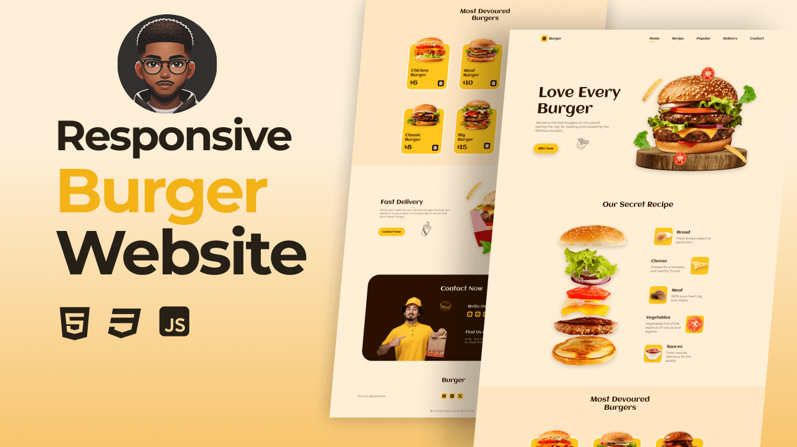

# 🍔Responsive Burger Website🍔

## Overview

The Responsive Burger Website is a modern web design created using HTML, CSS, and JavaScript, specifically tailored for a fictional burger restaurant. This project emphasizes a mobile-first approach, ensuring compatibility with all mobile devices while also providing a beautiful and pleasant user interface for desktop users.

## Features

- **Mobile-First Design**: Developed initially for mobile devices, ensuring an optimal user experience on smartphones and tablets.
- **Responsive Layout**: The website adapts seamlessly to various screen sizes, making it compatible with all mobile devices and desktops.
- **Smooth Scrolling**: Each section features smooth scrolling effects, enhancing navigation and user experience.
- **Scroll Animations**: Engaging animations trigger as users scroll through the website, adding visual appeal and interactivity.
- **User-Friendly Interface**: A clean and aesthetically pleasing design that is easy to navigate.


You can view the live version of the Responsive Burger Website [here](https://burgerbite-ana-md.netlify.app/).

## Usage Instructions

1. Clone the repository using the following command:
   ```bash
   git clone https://github.com/AnaMdTech/Responsive-Burger-Website.git
   ```
2. Open index.html in your web browser to view the website locally.
   ## Technologies Used
   - **HTML**
   - **CSS**
   - **JavaScript**

## License

This project is licensed under the MIT License.
